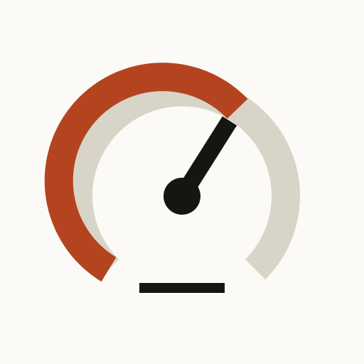

<p align="center">
  
</p>

<h1 align="center">Meterlex</h1>

<p align="center">
  Local-first cost intelligence for AI coding tools.<br />
  Every token priced. Every subscription measured.
</p>

<p align="center">
  <a href="actions/workflows/ci.yml"></a>
  <a href="LICENSE"></a>
  
</p>

---

Meterlex reads the session logs your coding tools write to disk, prices every
model call at the public API rate, and shows you what the subscription actually
costs you versus what you would pay on consumption. The flat monthly fee hides
the real usage — Meterlex makes it visible.

It works across your machines. A small collector on each one (a single Python
file, no dependencies) reads that machine's logs and sends **token counts
only** to one hub. The hub is two Docker containers and a SQLite file you
host; transcripts never leave the machine that wrote them.

> **Project status:** actively developed and suitable for personal/local use.
> Log formats and model rate cards can change, so verify figures before using
> them for accounting. The API is unauthenticated and must not be exposed
> directly to the public internet.

## What it tracks

- **Claude Code** — every reply from `~/.claude/projects/**/*.jsonl`, with its input / output / cache token breakdown. Claude Code logs each part of a reply (thinking, text, each tool call) as its own line carrying the whole reply's usage, so replies are counted once, by message id, at their final numbers; counting lines overstated tokens about 2.5×. Each reply records whether it was interactive, an automated SDK run or a subagent.
- **Codex** — per-turn token deltas from `~/.codex/sessions/**/*.jsonl` via `token_count` events (a repeated event with an unchanged running total is skipped); OpenAI Codex endpoint billed against ChatGPT Pro quota
- **Antigravity** — per-conversation SQLite DBs at `~/.gemini/antigravity-cli/conversations/*.db`; token counts extracted from protobuf step payloads, model IDs from `gen_metadata` blobs
- **Gemini CLI** — each message from `~/.gemini/tmp/<project>/chats/*.jsonl`, once: the CLI appends a message again every time it updates it. Cached input is its own count and thoughts are billed as output.
- **Ollama** — non-Claude models run through Claude Code (`ollama launch claude`: GLM, Kimi, DeepSeek, MiniMax…). Ollama Cloud models are priced at Ollama's own per-token rates from model-prices; models that ran locally are €0.
- **Copilot CLI** — per-session, per-model token totals from `~/.copilot/session-state/*/events.jsonl` (older CLIs: `~/.copilot/data.db`), priced at each model's rate. In-editor Copilot usage is not exposed locally and is not counted. Variable subscription charges can be entered as monthly bills in Prices & settings.
- **Machines** — every turn records the machine it came from, and each machine's projects are stored as a full path, a folder name or a hash, as you choose per machine.

### What the app shows

Four readings and a settings screen, over **this week (Monday start), this month
or this year** — periods counted in your own time zone, never UTC:

- **Now** — the reading itself: tokens as an odometer, list price against what the
  subscriptions actually cost over that period, how much the subscriptions earn,
  the share replayed from cache, tokens per day, and where the work happened.
- **Machines** — one meter per machine: its reading, its share, the shape of its
  period, when its collector last reported, and which machines went silent.
- **Harnesses** — per tool: tokens, replies, models, list price against its fee,
  and the token split.
- **Models** — every model in the period, ranked, with the harness that ran it.
- **More** — subscriptions and FX, the collectors and their last report, and a
  link to the rate card, which lives in its own app.

Costs are computed as `(input × prompt_rate + output × completion_rate + cache_read × cache_read_rate + cache_write × cache_write_rate) × fx_rate`. Savings are `API cost − subscription` — positive means the subscription wins.

## Quick start

### Prerequisites

- Docker Desktop or Docker Engine with Docker Compose v2 on the hub
- At least one supported coding tool with local session data, and Python 3.9+ (or [uv](https://docs.astral.sh/uv/)) on each machine that runs one
- Ports `5180` and `8692` free on the hub (both bind to 127.0.0.1)

Clone the repository, create the local configuration, and start the stack:

```sh
git clone <repository-url>
cd meterlex
cp .env.example .env
# Edit .env for your machine, then:
docker compose up -d
```

| Surface | Address |
| --- | --- |
| Dashboard | `http://localhost:5180` |
| Health check | `http://localhost:8692/api/health` |
| Interactive API docs | `http://localhost:8692/docs` |

Check startup health with `docker compose ps` and follow logs with
`docker compose logs -f`. Stop the application with `docker compose down`.
Usage data remains in `data/meterlex.db`; remove that file only when you
intentionally want a fresh local database.

### Configuration

Docker Compose automatically reads `.env` from the repository root.

| Variable | Purpose |
| --- | --- |
| `HUB_MACHINE` | The machine name for history stored before collectors reported per machine: use the name the hub machine's own collector reports under |
| `LOCAL_TZ` | The zone periods are counted in (default `Europe/Paris`). A week starts Monday 00:00 there and a day at local midnight; rows stay stored in UTC |
| `PRICES_URL` | Where the model-prices app is reachable from a browser. The Prices link on the More screen points there; leave empty to hide it |

The hub reads no session logs itself: every machine, the hub's own included,
runs the collector. To reach the hub from other machines, keep it off the
public internet and serve it on a private network, for example
`tailscale serve --bg --https=5180 http://127.0.0.1:5180`.

### Add a machine

The collector is `collector/meterlex_collector.py`: one file, standard library
only, Python 3.9+. It keeps its place in each log file, spools what it could
not send and retries, and sends **counts only**: tool, model, time, session id,
project label and token numbers. Prompts, replies and file contents are never
sent; `run --dry-run` prints exactly what would go.

1. On the hub, create the machine's key. It is shown once; only its hash is stored.

   ```sh
   docker compose exec backend python manage.py machine-add work-laptop --labels basename
   ```

   `--labels` sets how that machine's projects are stored: `full` (the path),
   `basename` (the folder name only) or `hash` (an opaque label). The collector
   applies it before sending and the hub enforces it again.

2. On the machine, keep the collector in a folder of its own (the scheduled
   job runs it from there). macOS or Linux:

   ```sh
   mkdir -p ~/meterlex && cd ~/meterlex
   curl -fsSLO https://raw.githubusercontent.com/brbousnguar/meterlex/main/collector/meterlex_collector.py
   python3 meterlex_collector.py setup --hub https://<hub>:5180 --key <key> --machine work-laptop --labels basename
   python3 meterlex_collector.py run --dry-run   # what would be sent
   python3 meterlex_collector.py run             # the first send
   python3 meterlex_collector.py install         # every 5 minutes, as a launchd agent
   ```

   Windows (PowerShell), with uv providing Python:

   ```powershell
   mkdir $HOME\meterlex; cd $HOME\meterlex
   irm https://raw.githubusercontent.com/brbousnguar/meterlex/main/collector/meterlex_collector.py -OutFile meterlex_collector.py
   uv run meterlex_collector.py setup --hub https://<hub>:5180 --key <key> --machine work-laptop --labels basename
   uv run meterlex_collector.py run --dry-run
   uv run meterlex_collector.py run
   uv run meterlex_collector.py install          # a Scheduled Task every 5 minutes
   ```

`status` shows the configuration, which tool folders were found, what is
waiting to be sent and the last run. The collector reads `~/.claude/projects`,
`~/.codex/sessions`, `~/.gemini/antigravity-cli`, `~/.gemini` and `~/.copilot`;
set `"paths"` in its `config.json` (`~/.config/meterlex/`, or
`%APPDATA%\meterlex\` on Windows) to point elsewhere. `manage.py machine-list`
shows each machine's last report; `machine-revoke` stops a key.

## How it is put together

```text
collector/
  meterlex_collector.py  Runs on each machine: reads the tools' logs, sends counts
backend/
  main.py           FastAPI application and REST API
  ingest.py         Stores collectors' batches: one row per reply, tool attribution, pricing
  machines.py       Machine keys (stored hashed)
  manage.py         Admin commands: machine keys, legacy dedupe
  pricing.py        Price resolution: mirrored rate card → Meterlex's fallbacks → free
  models.py         SQLModel schema (UsageTurn, Machine, ModelPrice, Setting, ManualBill)
  database.py       Engine, session helpers, column migrations
frontend/
  src/
    components/     Dashboard, ToolDetail, PricesSettings, InfoTip
  public/
    brand-mark.svg  Identity mark and favicon
data/
  meterlex.db       SQLite database
docker-compose.yml  Two-service stack (backend + nginx-served frontend)
```

Nginx serves the React frontend and proxies `/api/` to FastAPI, so one address serves the dashboard and collectors' `/api/ingest`. The backend pulls the shared rate card at startup; collectors send new usage every 5 minutes.

Upgrading from the in-container scanner: after deploying, run the hub machine's
collector once (it re-sends every transcript still on disk, which folds the old
one-row-per-logged-part Claude Code rows into one per reply), then
`manage.py dedupe-legacy` to report the same fold for rows whose transcripts
are gone, and `dedupe-legacy --apply` to do it. Back up `data/meterlex.db` first.

## Tests and continuous integration

Backend tests use isolated in-memory SQLite databases and synthetic log events:

```sh
python -m pip install -r backend/requirements-dev.txt
python -m pytest
```

Build the React application with:

```sh
cd frontend
npm ci
npm run build
```

Maestro browser journeys in `.maestro/` exercise initial dashboard rendering,
tool navigation, and the prices/settings screen using accessible selectors.
With the Docker stack running, execute them using
`maestro test --platform web --headless .maestro`.
GitHub Actions runs backend tests, the production frontend build, repository
hygiene checks, dependency audit, Docker Compose validation, and Maestro flow
YAML validation for pull requests targeting `main` and pushes to `main`.
Maestro's desktop-web support is currently beta, so the full browser journeys
remain an explicit local check instead of a required merge gate.

For a local development server without Docker:

```sh
# Terminal 1
python -m venv .venv
source .venv/bin/activate
python -m pip install -r backend/requirements-dev.txt
cd backend && uvicorn main:app --reload --port 8692

# Terminal 2
cd frontend
npm ci
npm run dev
```

On Windows PowerShell, activate the environment with
`.venv\Scripts\Activate.ps1`. The Vite development server proxies `/api` to the
backend on port `8692`.

## Privacy and security

- Collectors send token counts only, never prompts, replies or file contents;
  `run --dry-run` shows every field. Rows keep a project label: the full path,
  the folder name or a hash, per machine.
- Each machine sends with its own key, stored on the hub as a SHA-256 hash; a
  revoked key is refused.
- Runtime databases, environment files, coverage output, and browser artifacts
  are ignored by Git.
- Use synthetic fixtures in issues and pull requests; never upload raw prompts,
  session logs, invoices, credentials, or employer/client data.
- The dashboard and read API have no authentication. Both ports bind to
  127.0.0.1; reach them over a private network (e.g. Tailscale) and review
  [SECURITY.md](SECURITY.md) before deployment.

Contributions are covered by the [MIT License](LICENSE); see
[CONTRIBUTING.md](CONTRIBUTING.md) for the development workflow.

## Known limitations

- Results depend on undocumented local log formats that tool vendors may
  change without notice.
- Historical data is limited to what each local tool still retains.
- Model aliases and bundled/automatic model selection may require approximate
  pricing; rates are overridden at the model-prices service, not in this UI.
- The application does not authenticate users or encrypt its SQLite database.
- Figures are estimates for engineering insight, not invoices or accounting
  records.

## Roadmap

The near-term priorities are parser fixtures for more log-format versions,
stronger end-to-end coverage, configurable retention, and easier export of
aggregated data. Feature requests and parser samples are welcome as GitHub
issues, but samples must be synthetic and contain no prompts or identifying
paths.

## API surface

| Method | Route | Purpose |
| --- | --- | --- |
| `GET` | `/api/health` | Status, total turns, last ingest timestamp, turns per tool and per machine |
| `POST` | `/api/ingest` | A collector's batch (`Authorization: Bearer <machine key>`); returns inserted / updated / folded / rejected |
| `GET` | `/api/machines` | Each machine: label policy, last report, collector version, turns and tokens |
| `GET` | `/api/config` | What the UI needs about this deployment: the rate card's address and the period time zone |
| `GET` | `/api/overview` | Everything one screen needs for a period (`?period=weekly\|monthly\|yearly`, `?ref=`, `?machine=`, `?source=`): totals with the token split, the same-length period before, by machine, harness, model, project and origin, and a bucketed series with the empty buckets kept |
| `GET` | `/api/summary` | Per-tool cost summary with subscription comparison (`?machine=` filters) |
| `GET` | `/api/spend` | Aggregated spend for a period, by model, project, machine and origin (`?source=`, `?machine=`) |
| `GET` | `/api/spend/timeseries` | Bucketed series (daily / monthly / yearly) with per-source, per-model and per-machine splits |
| `GET` | `/api/prices` | All model prices (mirrored from the model-prices service) |
| `POST` | `/api/prices/mirror-pull` | Pull latest rates from model-prices and recompute all costs |
| `GET/PATCH` | `/api/settings` | FX rate and per-tool subscription amounts |
| `GET` | `/api/bills/{source}` | Per-month manual bills (used for variable Copilot charges) |
| `PATCH` | `/api/bills/{source}/{year_month}` | Set or update a monthly bill |
| `POST` | `/api/recompute` | Reapply current prices to all history |

## Pricing policy

The rate card itself lives in [model-prices](https://github.com/brbousnguar/model-prices), a small shared service also used by openclaw-spend, and is mirrored into Meterlex's local `model_prices` table (read-only here — edit rates there, not in this app). A weekly cron pulls the latest rates into both apps every Monday at 05:00 and recomputes historical costs; use **Recompute all costs** to do that on demand. Gemini models without an exact match fall back to the generic flash-tier entry; unrecognised `glm-*` IDs fall back to the GLM-5.2 tier; unrecognised `gpt-5*` IDs fall back to the base GPT-5 tier — this fallback logic itself stays local to Meterlex. Turns Ollama served are priced at Ollama Cloud's own per-token rates (model-prices' `ollama/<model>:cloud` rows) when Ollama sells that model in its cloud; any other model Ollama served ran locally and is €0, like `local/*` and `<synthetic>` events. Copilot CLI models without a rate of their own use the representative `copilot-auto` rate. FX defaults to 0.92 (USD → EUR), editable in settings.

## Visual identity

**Meter Room** — the full system, with every measured value, is in
[`DESIGN.md`](DESIGN.md); that file and `frontend/src/index.css` change together.
The short version: the app is a meter, so the number is the design. Flat,
hard-edged, separated by hairlines, with an odometer for the reading and one
meter card per machine.

Colour means exactly two things. **Harness identity** — one measured swatch per
tool, Codex deliberately the neutral one — and **direction**, whether the list
price sits above or below what the subscriptions cost. Machines and models carry
no colour; they are ranked by the number.

| Role | Colour | Use |
| --- | --- | --- |
| Paper | `#fbfaf6` | Canvas (dark: `#131519`) |
| Ink | `#151512` | Type and structure (dark: `#f2f4f7`) |
| Claude Code | `#b4441f` | Harness identity |
| Ollama | `#6e40c9` | Harness identity |
| Gemini CLI | `#1b5ec4` | Harness identity |
| Antigravity | `#0e7b3c` | Harness identity, and "under the fee" |
| Copilot | `#8a5300` | Harness identity |
| Codex | `#2f3a44` | Harness identity, the one without a hue |
| Over | `#c4322b` | List price above the fees |

Numbers and headings are **Archivo**, body text **Hanken Grotesk**, machine names
and model ids **IBM Plex Mono**. The mark is a dial reading part of full scale;
the PNG icons are rendered from `frontend/public/icon.svg` with
`rsvg-convert -w <size> -h <size> icon.svg -o icon-<size>.png`.

The app installs as a PWA: serve it over HTTPS on your private network and add it
to a phone's home screen.

---

<p align="center"><code>SCAN / PRICE / TRACK</code></p>
